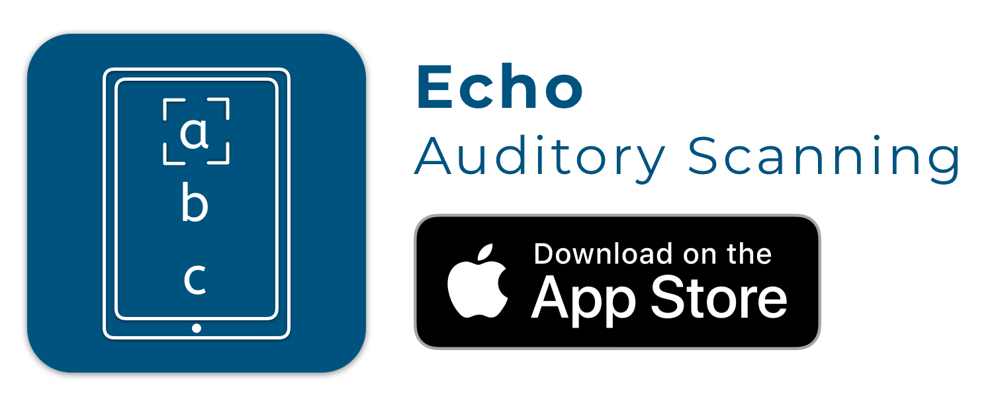

# Introduction

<figure><figcaption>
<a href="https://apps.apple.com/gb/app/echo-auditory-scanning/id6451412975">https://apps.apple.com/gb/app/echo-auditory-scanning/id6451412975</a>
</figcaption></figure>

Echo is an AAC app designed for those with a visual difficulty and physical difficulty to access communication.

Echo is based around the concept of auditory scanning. Auditory scanning is a communication method using sound cues or auditory feedback rather than visual cues. This method is especially valuable for those with a visual impairment who cant access visual based AAC.

Echo provides you with two different voices, one for your auditory cues and the another to represent your voice.

For a detailed video how to use Echo checkout the video below.


